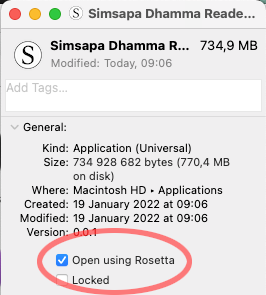

# Simsapa Dhamma Reader

## Install

Download the [latest build](https://www.dropbox.com/sh/j26b8sb955hj5x6/AABh0SCsRA7bY1bTGhKA5x1Pa?dl=0) for Linux (.AppImage), Mac (.dmg) or Windows (.msi).

On the first run, it downloads the application database and fulltext index.

Short feature demo: <https://vimeo.com/677880749>


### MacOS

Download the latest `.dmg.zip` from [Releases](https://github.com/simsapa/simsapa/releases/).

Extract and open the `.dmg` file.

Drag the Simsapa icon to Applications.

**Allow apps from third-party locations:**

Open System Preferences > Security & Privacy > General tab

Click on the lock icon in the bottom left and enter your admin password.

Next to the message `"Simsapa" was blocked because...`, click `Open Anyway`.

**Enable Rosetta:**

Open Finder > Applications

Right click on the Simsapa icon, and enable "Open using Rosetta"



### Linux

Download the latest `.AppImage.zip` from [Releases](https://github.com/simsapa/simsapa/releases/).

Extract and add executable permissions to the `.AppImage` file.

**Ubuntu 22.04:** The HTML content pages will be blank, you have to start Simsapa with the following env variable:

``` shell
QTWEBENGINE_DISABLE_SANDBOX=1 ./Simsapa_Dhamma_Reader-0.1.8a1-x86_64.AppImage
```

For the app launcher, it can be useful to create a `simsapa.desktop` file in `~/.local/share/applications` such as:

```
[Desktop Entry]
Encoding=UTF-8
Name=Simsapa
Terminal=false
Type=Application
Exec=env QTWEBENGINE_DISABLE_SANDBOX=1 /path/to/Simsapa_Dhamma_Reader-0.1.8a1-x86_64.AppImage
```

## Removing the Application Database

The Simsapa application database (where the suttas, dictionaries, etc. are stored) is not removed when un-installing Simsapa.

Use the terminal to remove the applications local data folder:

**MacOS:**

``` shell
rm -r ~/Library/Application\ Support/simsapa
```

**Linux:**

``` shell
rm -r ~/.local/share/simsapa
```

**Windows:**

``` shell
rmdir /s /q C:\Users\%USERNAME%\AppData\Local\simsapa
```

## Development

Install Poetry, clone this repo and run `poetry install` to install dependencies.

In the project root, enter a venv with poetry and start the app with:

``` shell
poetry shell
./run.py
```

### .env

Environment variables can be set with a `.env` file is in the project root.

Recognized settings:

```
ENABLE_PRINT_LOG=true
```

Print log messages as well as writing them to `~/.local/share/simsapa/log.txt`

```
USE_TEST_DATA=true
```

Instead of connecting to database in the user's folders, connect to the test
database found in `tests/data/assets/`

```
ENABLE_WIP_FEATURES=false
```

Whether to enable work-in-progress feature which may be unstable or broken.

### Editing application windows with Qt Designer

Install Qt Designer and dependencies from the distro package manager (not `pip`).

``` shell
sudo apt-get install qttools5-dev-tools python3-pyqt5 python3-pyqt5.qtquick libqt5designer5 libqt5designercomponents5
```

Open the `.ui` file in Qt Designer, in or out- of the project venv.

``` shell
designer ./simsapa/assets/ui/dictionary_search_window.ui
```

After saving the `.ui`, re-generate the `.py` files. The Makefile target calls `pyuic5 `.

``` shell
make ui
```

Don't use the pip pacakges frequently recommended in tutorials (`pip install
pyqt5 pyqt5-tools`), these are often compiled at different Qt versions, and may
result in Qt Designer crashing with the following error:

```
...Qt/bin/designer: symbol lookup error: ...Qt/bin/designer: undefined symbol: _ZdlPvm, version Qt_5
```

## Tests

All tests:

``` shell
make tests -B
```

A single test:

``` shell
USE_TEST_DATA=true pytest -k test_dict_word_dictionary tests/test_dictionary.py
```

